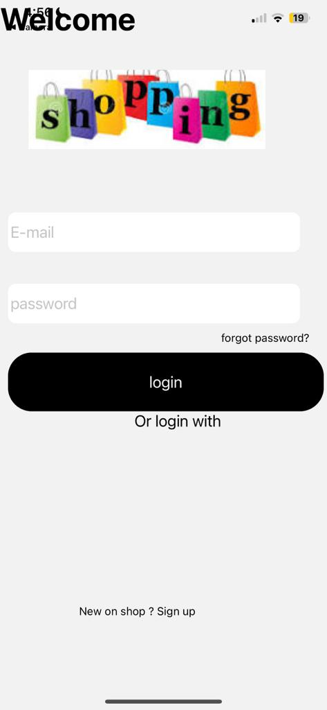

# Ecommerce app

The React Native e-commerce project is a mobile application built using React Native, designed to provide users with a convenient and intuitive platform for shopping. The app offers a wide range of features to enhance the user experience.

Users can create accounts and log in to access personalized features such as order history and saved preferences. The product catalog is carefully organized, allowing users to browse through various categories and easily find the items they are interested in. The search functionality enables users to quickly locate specific products by entering keywords or applying filters.

Once users find the products they want to purchase, they can add them to their shopping cart. The app supports a seamless checkout process, allowing users to review their cart contents, apply discount codes if available, and choose from multiple payment options.

To keep users informed about their orders, the app includes order tracking functionality. Users can monitor the progress of their orders in real-time, including estimated delivery dates and shipment tracking details. This helps users stay updated and anticipate the arrival of their purchased items.

Additionally, the app encourages user engagement by allowing customers to provide feedback through ratings and reviews. Users can share their opinions and experiences with products, helping other users make informed decisions.

The app also incorporates push notifications to keep users informed about order updates, promotions, and other relevant information. These notifications ensure that users are aware of important updates and can take necessary actions promptly.

Furthermore, the app utilizes analytics and reporting tools to gather valuable data on user behavior, such as popular products and conversion rates. This data can be used to optimize marketing strategies, improve the app's performance, and enhance the overall user experience.

With its user-friendly interface, cross-platform compatibility, and a range of features, the React Native e-commerce project aims to provide users with a seamless and enjoyable shopping experience, ultimately driving customer satisfaction and business growth.

## Features

Certainly! Here are some specific features commonly found in e-commerce projects developed using React Native:

Add to Cart: Users can add products to their shopping cart with a single tap, allowing them to collect multiple items before proceeding to the checkout process.

Quantity Selection: Users can select the desired quantity of a product they wish to purchase, adjusting it as needed.

Reviews and Ratings: Users can view and submit reviews for products, as well as rate them based on their satisfaction or experience.

Commenting System: Users can leave comments or engage in discussions related to specific products, sharing their opinions, asking questions, or providing additional information.

Wishlist: Users can create a wishlist of products they want to save for future reference or purchase, making it easier to keep track of desired items.

Order History: Users have access to a comprehensive history of their past orders, allowing them to review previous purchases and track their status.

Save for Later: Users can save products for later consideration, enabling them to revisit and potentially purchase them at a later time.

Discount Codes: Users can apply discount codes during the checkout process to avail themselves of special offers or promotions.

Social Sharing: Users can share product details, reviews, or their shopping experience on various social media platforms, spreading the word and potentially influencing others' buying decisions.

These specific features enhance the functionality and usability of the e-commerce app, allowing users to interact with products, make informed choices, and engage with the community.

## Screenshots

_Screen consists of a login and sign-up section. Users can either log in with their existing credentials or create a new account by signing up. TUsers can navigate between the login and sign-up sections based on their needs._

_Screen consists of an email input field, a password input field, and a login button. Users can enter their email address and associated password, then click the login button to initiate the authentication process. This screen focuses on capturing the necessary login information and facilitating a smooth login experience._

[Screenshot 3](./assets/IImage3.jpeg)
_Screen consists of input fields for email, name, password, and confirm password, along with a sign-up button. Users can enter their email address, name, and desired password, then confirm the password by re-entering it in the respective field. Finally, they can click the sign-up button to create their new account. The screen focuses on collecting the necessary information and enabling users to register for an account._

[Screenshot 4](./assets/IImage4.jpeg)
_Screen 4 presents a selection interface where users can choose their favorite product from a list of daily-use items. It includes a text input field for searching specific products and two flat lists showcasing a variety of daily needs items. Users can either search for a specific product or scroll through the lists to make their selection._
[Screenshot 5](./assets/IImage5.jpeg)
_Screen 5 displays the details of a selected item, including its image, price, name, and rating. Users can adjust the quantity using a numeric input field and add the item to their cart with an "Add to Cart" button. Additionally, there is a text box for users to write a review, and a submit button to submit the review for others to see._
[Screenshot 6](./assets/IImage6.jpeg)
_Screen 6 displays the details of a selected item, including its image ,price, name, and rating. Users can adjust the quantity using a numeric input field and add the item to their cart with an "Add to Cart" button. Additionally, there is a text box for users to write a review, and a submit button to submit the review for others to see._
